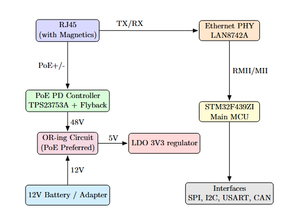

# Hamownia PCB Documentation

**AGH Space Systems – Szymon Hamownia Project**  
Authors: Mikołaj Sala, Piotr Słonka  

---

## 📖 Overview
This repository contains the documentation of a custom **Power over Ethernet (PoE) enabled PCB** designed for the **Szymon Hamownia** test stand for bi-propellant rocket engines.  
The board integrates **Ethernet communication** and **power delivery** into a single compact system, featuring an STM32 microcontroller as the main processing unit.

This repo is intended as a **research and portfolio reference** – it provides documentation, diagrams, and design insights, but does **not** contain full manufacturing files.

---

## ✨ Key Features
- 100Base-TX Ethernet communication
- Power over Ethernet (PoE, IEEE 802.3af Type 1)
- STM32F439ZI ARM Cortex-M4 MCU
- On-board support for SPI, I²C, USART, and CAN
- 48 V input via PoE → 5 V @ 2 A DC/DC conversion
- Integrated magnetics RJ45 connector
- 4-layer PCB with separated ground planes for signal integrity

---

## 📂 Repository Structure

📦 **hamownia-pcb-docs**
┣ 📂 `docs/`       — LaTeX source files and the compiled PDF documentation
┣ 📂 `diagrams/`   — System architecture, pinouts, and block diagrams
┣ 📂 `schematics/` — Exported PCB schematics (PDF/images)
┣ 📂 `examples/`   — STM32 firmware snippets and hardware test implementations
┣ 📂 `references/` — Component datasheets, manuals, and application notes
┣ 📜 `.gitignore`  — Standard ignore rules for LaTeX builds and backups
┣ 📜 `LICENSE`     — Open-source license terms
┗ 📜 `README.md`   — You are here

---

## 📑 Documentation
The complete PCB documentation (schematic breakdown, PCB stackup, and assembly instructions) is available in [`docs/`](docs/).  
- Main PDF: `hamownia_with_style.pdf`  
- Source: `hamownia_with_style.tex`

---

## 📐 System Block Diagram

---

## ⚠️ Disclaimer
This project is provided **for research and reference only**.  
It is **not intended for direct manufacturing** and may not reflect final tested hardware.

---

## 📜 License
This work is licensed under the **Creative Commons Attribution-NonCommercial 4.0 International License (CC BY-NC 4.0)**.  
See the [LICENSE](LICENSE) file for details.
